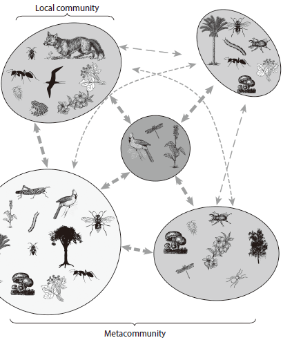
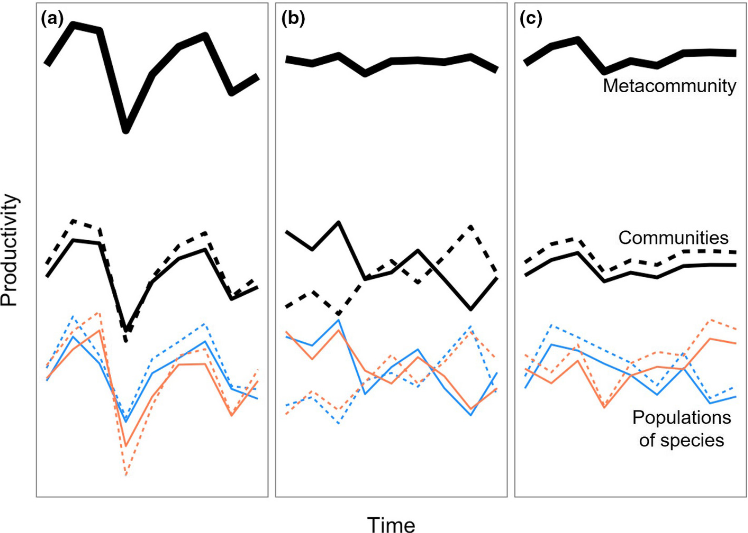

```{r setup, include=FALSE}
library(tidyverse)
options(htmltools.dir.version = FALSE,
        htmltools.preserve.raw = FALSE)

knitr::opts_chunk$set(warning=FALSE, message=FALSE)
```


```{r load_refs, echo=FALSE}
library(RefManageR) # bibliography and citation
BibOptions(check.entries = FALSE,
           bib.style = "authortitle",
           cite.style = "authoryear",
           style = "markdown",
           no.print.fields= c("doi", "url", "issn", "pages"),
           hyperlink = TRUE,
           dashed = FALSE)
myrefs= ReadBib("myref.bib", check= FALSE)
```


```{r iconFUN, include=FALSE}
library(fontawesome)
icon_wlt= function(name, fill, w, l, t){
  pos= paste0("absolute; left:", l, "; top:", t)
  fa(name= name, fill= fill, width= w, 
                position = pos)
}
```


class: inverse
background-image: url(pic/nefu-vw.svg), url(pic/xingzhenglou.png)
background-size: 10%, 40%
background-position: 10% 90%, 100% 50%
background-color: #4f6132

<br>
<br>

# Metacommunity

### Xue Kui

<hr style="background-color:#f7f8fa; width:40%; margin-left:0; height:2px; border:0px solid red;" />

Oct 24, 2022


---

layout: true

background-image: url(pic/nefu8.svg)
background-size: 60%
background-position: 100% 100%

---

# Community Ecology

- **Community ecology**, which is primarily concerned with patterns of species distribution, abundance and interactions.

<br>

**A fundamental question:**

.box-purple[
### Spatial Scale.
]


.footnote[
.xl[
`r Cite(myrefs, "wiki:Metacommunity")`
]
]

---

# Community Ecology


.l[
.sydney-blue[_**The clear limitation:**_]
]


.pull-left[
.box-grey[
Focus on **local-scale** processes

- Species interaction
- Biodiversity
- ....

]]

.pull-right[
 
]

--

<br>
>The major weakness of traditional community ecology, and why it has so conspicuously failed to come up with many patterns, rules and workable contingent theory, is its .sydney-red[**overwhelming emphasis on localness**].

>— Lawton (1999)

---
class: center, middle

To resolve this limitation, is there any workable concept / approach ?

--

<br>

A potential framework is

--

#Metacommunity

--

##(集合群落)


---
class: center, middle

`r icon_wlt("paperclip", "#e64626", "60px", "25%", "7%")`

## scale
####/skeɪl/

## dispersal
#### /dɪˈspɜːrsl/
## heterogeneity
#### /ˌhetərədʒəˈniːəti/

## ...

---

#Hierarchical framework



.pull-right[
.indent3[
.xxl[_**Scale up**_]
]

#### .box-gray[Population dynamics]
`r icon_wlt("arrow-trend-down", "#83a835", "80px", "63%", "36%")`

<br>
### .box-yellow[Community-process]
`r icon_wlt("arrow-trend-down", "#83a835", "80px", "63%", "58%")`
<br>
##.box-green[Metacommunity-  
process]
]

.footnote[
.xl[
`r Cite(myrefs, "metabook")`
]
]

---

#A study case

- Asynchrony among local communities stabilises ecosystem function of  
metacommunities.



.footnote[
.xl[
`r Cite(myrefs, "synchrony")`
]
]

---

class:refpage

# Reference

```{r results='asis', echo=FALSE}
PrintBibliography(myrefs)
```

---

class: bg-blue
background-image: url(pic/nefu-vw.svg)
background-position: 6% 92%
background-size: 11%


<br><br>

#.indent2[Thanks for attention!
]

<br>

<div style="padding-left:3cm;">
.pull-right[
<!-- [`r fa(name = "paper-plane", fill = "#ffff7f")` wsgwhym@163.com](mailto:wsgwhym@163.com)   -->
[`r fa(name = "link", fill = "#ffff7f")` xuekui.site (_Personal Website_)](https://xuekui.site/)
<!-- [`r fa(name = "twitter", fill = "#ffff7f")` @xuekui9](https://twitter.com/xuekui9)   -->
[`r fa(name = "github", fill = "#ffff7f")` @xuekui9](https://github.com/xuekui9)
]
</div>

---

群落生态学中一个重要的问题就是尺度问题，很多研究都不可避免地包含在一个限定区域内。小尺度可能倾向于用小尺度的过程描述（比如种间竞争），大尺度用大尺度过程来描述；

而传统的群落生态学观点，比如物种互作、共生、生物多样性，存在明显的局限性，即，主要关注于局部尺度。这些过程中发现的模式、规律，可能会受到争议。controversy


那么有没有一种可行的方法应对这种局限性？一个潜在的框架：metacommunity。

它将许多关键方面联系起来，跨尺度探索生态关系。

我们可以通过meta群落的方法获得不同层次的过程和模式。从种群动态扩展到局部群落水平的过程，或者生态系统水平过程（更大尺度）

为了更好地预测生态系统对环境变化的响应，关键的一步是量化生态系统功能的稳定性。


