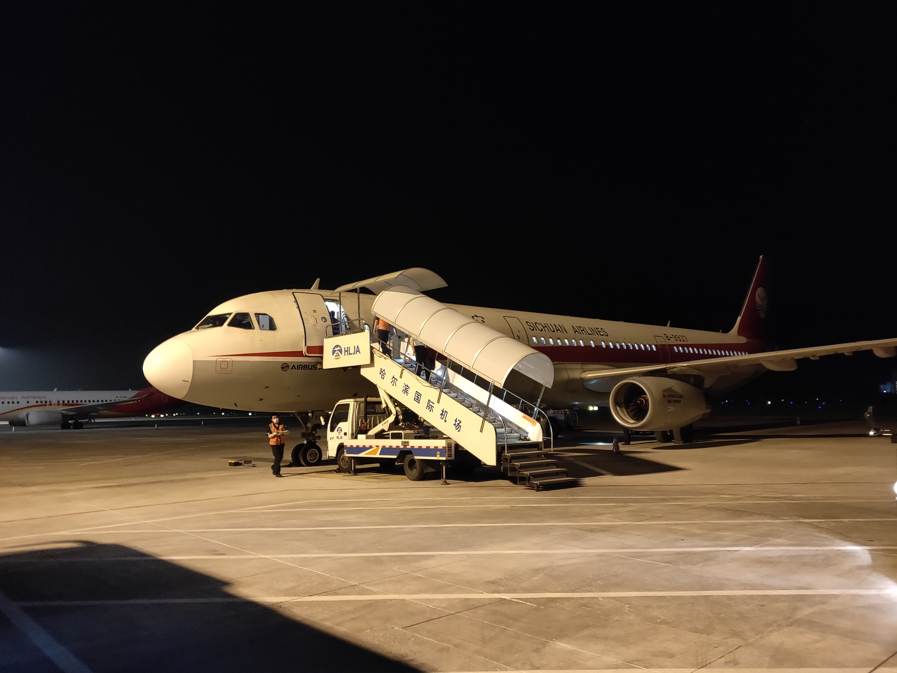

# 商讨返回

实验须在生长季进行采样，又是疫情正当之年。必须要回去了，因为没有人返校，所以不会有人帮忙采样。如果不，没有数据、延期结题会很麻烦。

怎么办？与老杨三下五除二达成一致，决定同天回去。


# 乘坐地铁

那天下午，和林达吃完饭已经下午6点多。计划地铁到西安北站，转机场快线。18:48-19:36，接近一个小时的地铁，原因是太困在地铁上睡着了。我应该在西安北站的前两站下车去取寄存在存知己的包裹，而我醒来时已经在终点站西安北。又坐反方向折返回去，出站时间19:36。

再进站，坐两站西安北。19:43-19:49。

此时正在高铁站南广场地下，中间是铁路到达口，对面是北广场地下。因为地铁机场快线入口是在北广场那边，正常步行两三分钟就可到达。可赶巧不巧，工作人员从中间设了阻隔，无法从南广场地下去北广场地下，何时恢复未知。看了看表，已经快晚上8点，我还在高铁站的南广场地下。飞机起飞时间，晚上9点半。

# 机场路上

我已经开始慌乱了。马上从地下前往地上广场，企图从地上穿过。先在右侧上了一层楼梯，左拐，又在左侧的楼梯下去。一整个呆住，这不是刚刚的地方吗，绕了一圈又回来，浪费了体力和时间。而左右手各拎着包，背上再一个包，都塞满了东西。


我在想，不能再这样乱寻路。要一边走一边问工作人员。边走、边跑、再走，嗓子干涸发苦、汗流浃背。于是，从南广场到北广场再到广场地下。寻找地铁入口，误入餐饮门店的区域。妈的，怎么找不到，又走错方向了，越急越乱。

自看到机场快线的路标起，到安检，到车厢口，又连走带跑好长的距离。结果，它闭了车门，刚走。下一趟，好像是10分钟，我内心是绝望的。进闸机到出闸机，20:18-20:58。晚上9点到达机场。

> 在地铁上，大脑高速运转。如果误机了怎么办？我还能哪些交通选择；如果行李不能带上飞机怎么办？我该怎么处理/邮寄我的行李，我是否要麻烦朋友来机场一趟？托运是别想了，早已过了时间。

老杨的一句话：没事，起飞前15分钟才关舱门，只要在这之间能到，就能上飞机。正是他的话，给了我继续赶机的希望和勇气。

# 安检到登机

奔向自助取票机，已经无法取票。再奔向检票口，人家说没有票是不行的，让我去窗口取。把大包小包扔到检票口那里，跑到窗口插队才取到票。走了vip绿色通道安检，但安检的细致程度又让我极度焦躁，从包里取出各种东西，没问题再重新塞回去，以至于拉链没拉好就继续提溜着走。时间大约在晚上9点10分。

寻找登机口H58。过了安检口，路标写的H30~H60。我在祈求，登机口序号是倒着来，那样，我只用经过几个口便可到达。可事与愿违。我靠！又是一盆冷水与看不到头的路。我想跑、我想冲，但身上的负重已让我无能无力。仍然，边走、边跑。

到达H56时，我朝向58号登机口大喊，H58，H58。希望工作人员能注意到我，他们仍在等我一人。这时正好21:15。乘务员没说托运的事情，让我登了机，并安慰着说不着急。

(ref:plane-land) 哈尔滨太平机场与川航，摆渡车上

```{r plane-land, echo=FALSE, out.width='100%', fig.cap='(ref:plane-land)'}

```


12点半落地 (Fig \@ref(fig:plane-land))，凌晨3点和老杨会了面。到宾馆门口，天已经亮了。


过程很不顺，结果是好的。以后宁早也不要晚了。。


