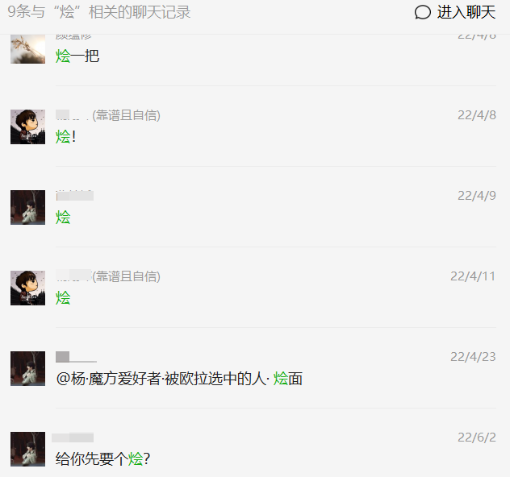
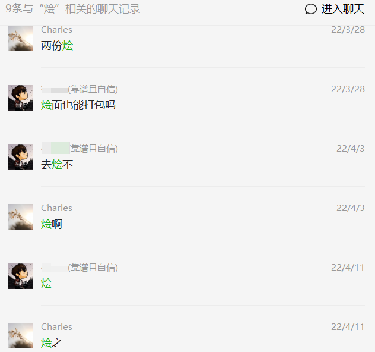
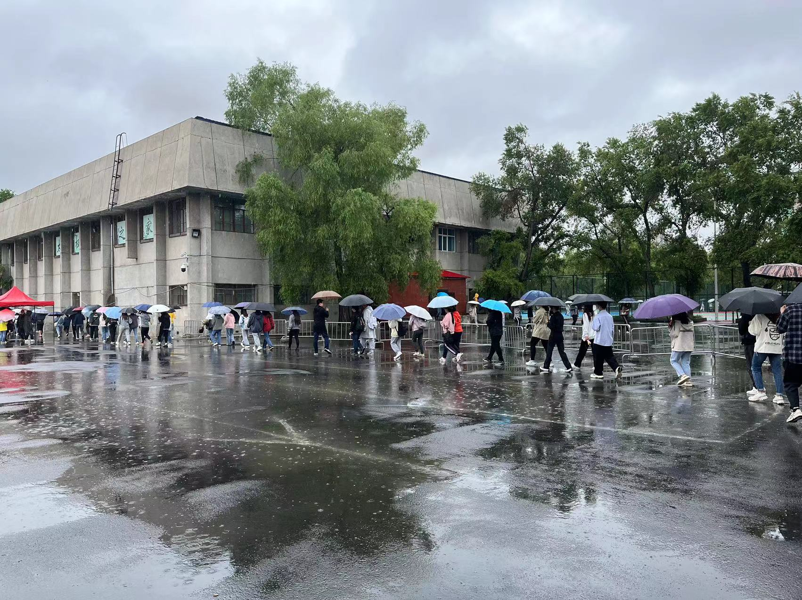
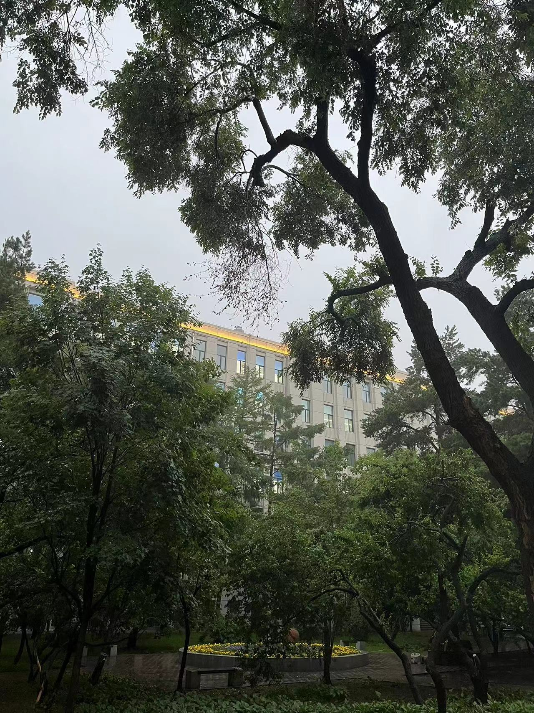
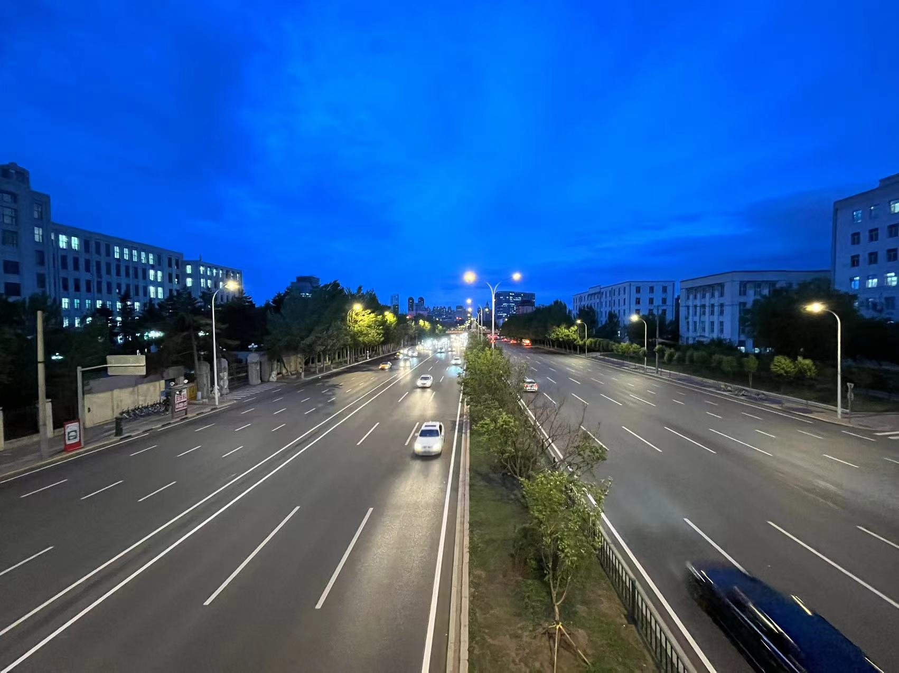
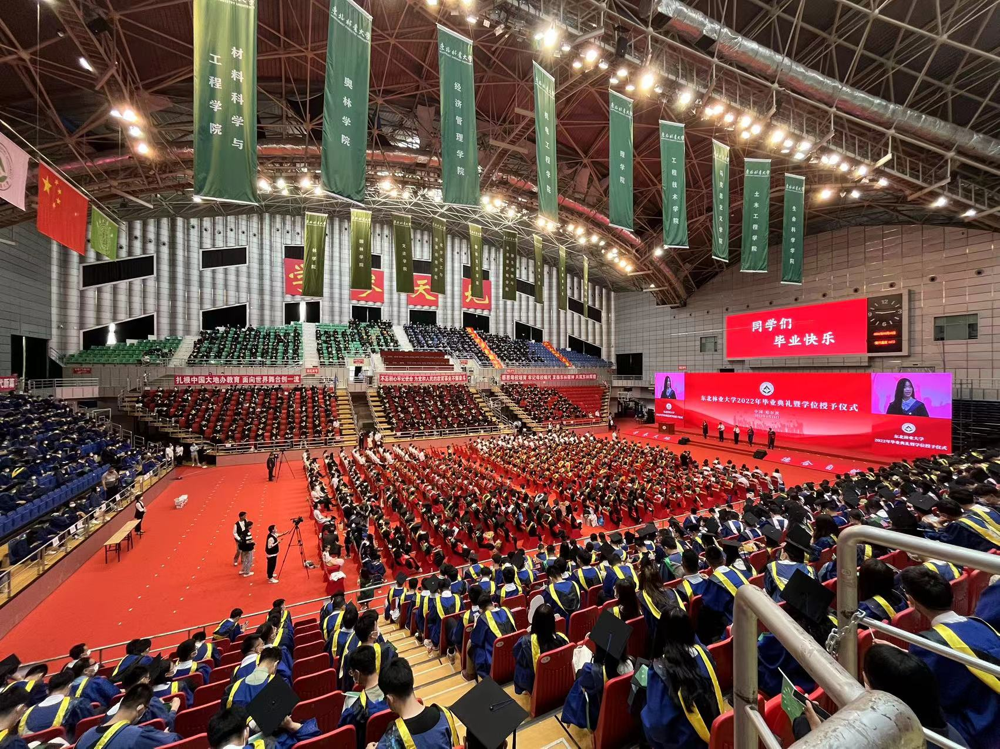
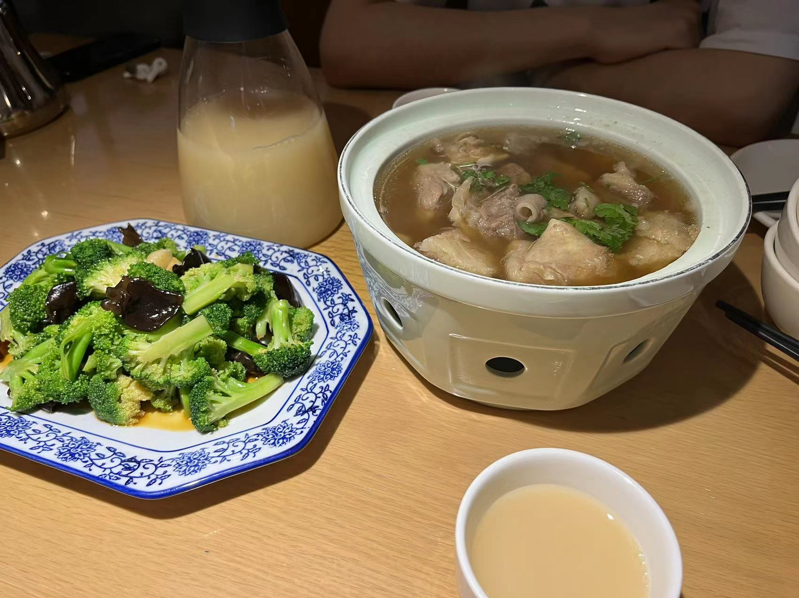

一边想去努力回想关于那个学期的残存记忆，另一边却又十分抵触与抗拒。这简直就是在上刑，想起的越多，遭受的痛苦就越多。虽然想不起多少、也写不了多少，只能靠相册照片去回忆。

开学一直封闭管理，其实做的最多的事情就是和狗比、老杨约饭，香锅、饺子、自选，以及三天两头的烩面，还有那无休止的核酸 : ( 。一直到5月下旬解封，去吃了吴记酱骨（5月22）。大概那顿饭之后，我才真正意识到，一晃这四年，真的要过去了。留余的日子那么短，可偏偏又像倍速一样过得那么快。吃一顿少一顿的食堂，住一天少一天的寝室。似乎一切都是在做减法。真正要分别的那一天，屋子里的空气都是安静的。

毕业典礼后的第二天送狗比，站在天桥上，我说：最后再看一眼学校吧。那个时候我就在想，今天之后，他会开启新的篇章，去下一个地方。天桥周围的这片楼宇还有天桥之下的和兴路，之后回想起来会是什么样的？我们的第二个故乡！

{width=50%}{width=50%}

 

典礼前的一两天去做核酸，我失落的走在篮球场旁，刚好碰到远处的向少，马上大喊：HL，等下我！。向少的出现像一道光，驱散了我落寞的心情。随后谈及分离，又不受控制的哽咽落泪。我说：叫了他四年的狗比，以后就再也叫不了了。

手机相册6月5号的一张照片，有狗比的半张身影。临近毕业前还是一直在抽检核酸。我觉得这一切都是在昨天，我觉得这是真实的。可偏偏不是这样，他已经在千里之外了。可能照片存在的意义就是在未来的某一时刻突然给你上演一场回忆杀。

{width=100%}

> 【关于做好近期学生出入校园管理的通知】
>
一、总体要求
随着哈尔滨本轮疫情清零，本着切实维护广大师生健康安全为第一前提，保障学生进出校园各类需求为工作指引，学校现对学生出入校园政策进行调整。相关调整坚持学校防疫“严于常态，严于社会面”双严原则，随疫情变化及时更新。
>
三、外出申请方式与要求如下
>
**自5月19日起学生可申请每日8:00—21:30之间因事请假外出，5月18日仅12:00—21:30；**

 
 

**下雨在六月。**

**分别在六月。**

**伤心在六月。**

 

{width=100%}{width=100%}{width=100%}{width=100%}
