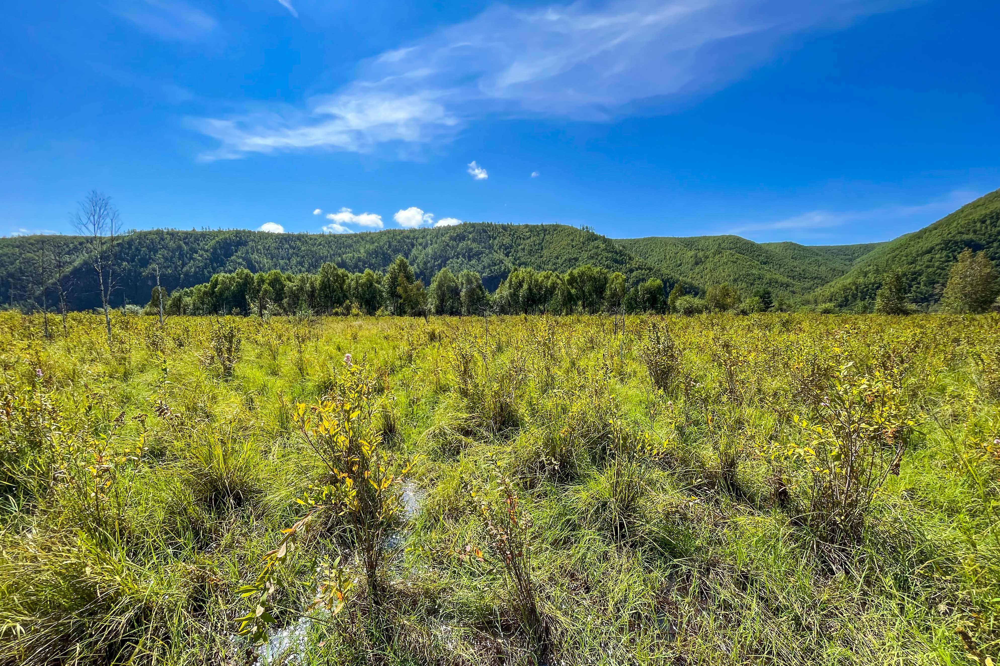

### 5月的解封

伴随着各种杂乱的事

> 写论文、学生证回收、健康证、毕业派遣信息填报、档案邮寄、毕业登记表、毕业问卷、就业状况核查、学士服租借、团关系转接；论文查重、答辩、实习日志、实习报告、各种材料打印、大四街、行李邮寄、毕业照、学位审核申请、毕业典礼

但我印象最深的还是练车，因为已经接近期限。那天中午去做核酸看到驾校业务恢复，第一时间打电话过去约了练车。本以为积压的原因会有很多人，短时间内可能约不到。没想到两天时间就等来了电话，我想都没想就答应下来：好没问题，我可以去。（**那一刻真是兴奋到了极点，我必去啊！这次谁都拦不住我**）。

事实上，上一秒有多狂，下一秒就有多惨。随后马上反应起来，练车的第一天好像要毕业答辩；于是反复地确定，可是我已经挂断电话了。我只能祈祷是线上答辩。

{width=90%}

答辩当天。还在去阿城的高速上，快下高速时开始答辩。开着热点、戴上耳机，一车的人目光都投过来。**我已经顾不了那么多了！！**下车的同时正好到了提问环节，然后就有了马路牙子上答辩这一幕，车来车往。我脑子里想的只是这些噪音传到会议里会有多大，老师们问了什么，我并听不太清......

这里特别感谢新雨发的录屏，记录了老师提出的问题和建议，救我一命

至于第一天练车，**是谁心不在焉被教练喷的狗血淋头，我不说。**

### 6月的毕业

一些已经习以为常的东西，在那段时间变得格外珍贵。幸而有狗比和老杨的照应，这最后八分之一枯涩的日子才变得熠熠生辉。分开与离别总归是伤心事。四年磨合刚有合拍之感，它却让你点到为止。生活大概就是这样。

只知道四年真的过得很快。**受益而不觉，失之而难存**

{width=100%}

{width=100%}

{width=100%}

### 8月的历练

从北纬45°到北纬53°，从大都市到无人区，翻越重重山峦，一路伴随的是厚密的蚊虫以及刺骨的寒水。跟漠河的石头山死磕，与阿尔山的寒冷抗衡。忘不了阿木尔的小镇烧烤，还有中俄边境上空的满天星辰。

眼睛、嘴唇上被叮的大包，突来的急雨，还有那管护站卡口嗷嗷叫的大狗，以及在高大塔头坑里不停地踉跄，算了，顾不上这些了。**享受这往往返返几千公里中的一切。**

{width=100%}

{width=100%}

### 9月的入学

与老胡、老杨再聚首，所有要说的话都在那听百威。

说起老杨，5月份有次因为材料跟他生气。就像他一贯在德育手册里随手写的职务：**混子**，他是真的混啊。在群里对他重拳出击，然后晚上回到寝室却只能边生气、边笑着对他说：**“你妈！”**

{width=90%}

### 不经意的感动

这些我都记在心里~

{width=90%}

