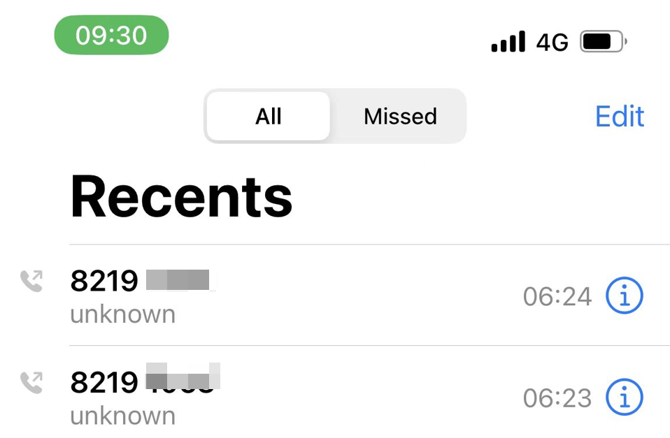
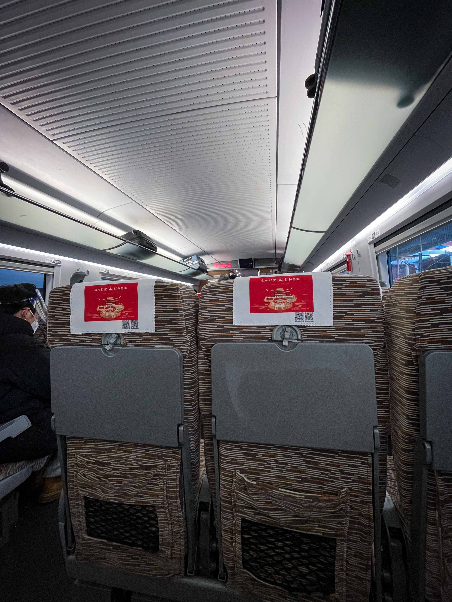

几乎每天都要念叨的两个字：权限

今天又在这两个字上卡壳。昨天给老杨打去电话，简单问了问离校的流程，那会他还在线上考试。跟我想的差不多，在学工系统申请一下就行了。反正刷卡验证失败了，到时候你拎着箱子说坐车回家，他总不能不让你进去吧

怕什么来什么。约了李琦兄吃早饭，6点去交通学院的卡口，“验证失败”，“验证失败”，“验证失败”。**“打电话给你辅导员给你授权！”**。可这么早打电话过去多冒昧。**“我不管他休不休息，那是他的事，你打电话给你辅导员！”**。于是打了一通QQ电话后，老师说他这会儿也没办法授权。**“那你进不了！”**。

**“ - - ”**

打算叫车的时候，达哥走了过来，看看能不能跟他进去。可以预见，又被拦了下来。达哥说：“你给他看一下学工系统的审批”。**“我不看什么学工系统，我只看卡！”**。我说老师我是真没权限，你就让我进去吧，我坐上车就离校了。**“你打电话给保卫处！8219 xxxx！”**，得到的反复是那边也没有权利放人进去。**“你打电话给疫情指挥部！8219 xxxx”**。

{width=80%}

这时候达哥在一旁看不下去了，直接开始对线。“现在你让我打那电话有什么用，为啥不让进呢”。达哥觉得，既然那边没有权限还打什么电话，他不就是隶属于保卫处吗。谢我达哥哈哈

**“你现在就按我说的做，打电话给疫情指挥部！8219 xxxx”**。请示领导后，挥手放了行。

我俩骂骂咧咧地走向了食堂。这叫什么事！原来那时候哪里有这么多事，现在尝到苦，才知道生活是真的苦。

回到我生长的地方.....

天亮了。

{width=100%}

