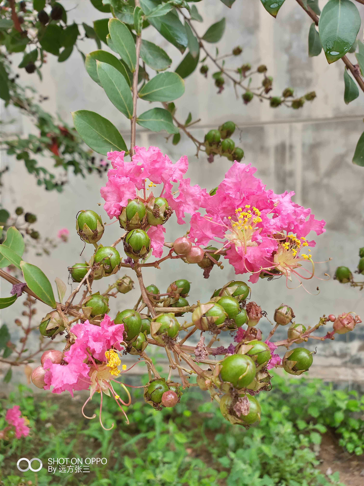

她离开了这个世界。

我至少有一年没看见她了，因为这一年中途未曾回家。这么多年，我对她的记忆只存有两处。

一处是她坐在那棵空了心的大槐树旁，假期回家路过经常可以遇到，从小到大，这画面我想我已经经历了不下100次，只是它太过于平常了；“这是谁回来了，这是谁家的？都这么大了”，大概是她们谈论最多的话题。但听说这一年来她几乎没出来过。

另一处是很久前的记忆，至少有10多年。有那么一个下午，她和老伴两个人坐在板凳上，给几棵植株修着枝。应该是当天下午就给栽下去了，他们的儿子拎桶给每个坑都浇了水，7、8棵的样子。第二年都活了下来，不同颜色的花。而且我记得，自从那，盛夏的中午每天放学路过，都会看到非常大的蜂绕着花飞来飞去。那种蜂好像比牛虻还要大一点，如果被蛰了，想想都很疼吧。

那个时候，我小学。

只不过没过多久，老汉就走了。这几棵花承载了他们共同的...，就像是他们老年时的一种“约定”吧，他们当时商量决定要栽这几株花的时候又是怎样一种心境和际遇呢？我不禁的想，在我出生的前七十年，她在那个时代又经历了些什么？现在她也走了，却留下了这份美好。

昨天跟妈吃饭的时候说起，才发现，十多年过去了，这几株花并没有长高。

明年这几株花还会照常盛开，如果那个时候我在家，我会过去拍几张。

然而到现在，我还不知道它是什么花

{width=100%}

