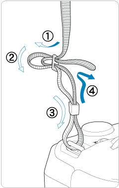

:see_no_evil:

[R6官方手册](https://cam.start.canon/zh/C004/)


## 几点常用操作 


1. 先调整屈光度。确保在取景器中看到的是清晰的

2. 镜头对焦环问题  
一般是自动对焦模式，咱们**不能**用手去拧镜头上的对焦环，会损坏对焦马达。

3. 取景器/屏幕取景之间的切换

- 红外感应自动切换（默认）
- 电子取景器像素更高，看起来颜色正，清晰 (相对于屏幕取景更耗电)
- 但室外光线过强时，屏幕一片黑，看不清


4. **然后一个重要的操作：**

i. 眼部对焦模式，有人物主体在画面里很好用；但是没有人物的时候，经常自动对焦点不在理想的位置。  
i. 这个时候，我们得改变自动对焦方式，比如单点自动对焦。  
i. 用取景器拍摄，同时手滑动屏幕，很容易调整对焦点。


也可以直接**触屏对焦**；或者用方向键来移动对焦点（第84页）


5. 查看相册

- 转动水平的转盘`r emo::ji("gear")`，连续放大缩小
- `r emo::ji("mag")`，放大镜把照片放大2倍
- 或者**直接触屏**缩放照片
- 上下左右移动照片摁**方向键**(`r emo::ji("mag")`左上角那个键)
- 切换图像: 拨动**大转盘**，很方便


6. 安装背带(Fig \@ref(fig:strap))


```{r strap, out.width="100%", fig.cap='Attaching the Strap安装背带示意图'}

```


7. WiFi传输到手机

- 相机先开启机内WiFi，然后点击WiFi/蓝牙连接；接着手机连上EOS R6的WiFi
- 打开APP传照片
- 导出前设置：JPEG、选择原始尺寸


书中P128-P131，Canon Camera Connect软件；

可以拍的时候用Raw格式，WiFi导到手机时候用JPEG格式


8. 导出/删除照片  
把SD卡的照片传到（复制到）电脑，然后弹出  
如果照片不用了，在相机里面进行**格式化**，（不在电脑上删除，只用电脑来拷贝）


9. Q键能设置什么？

- 自动对焦方式
  - **默认是眼部追焦**，拍人像确实好用啊
  - 拍静物的时候，可以换成单点对焦，或者扩展自动对焦区域
- 驱动模式：高速、低速连拍
- 测光模式：默认的评价测光就可以


10. `INFO键`，一次一次地按，调整屏幕的显示信息


---

**三个拨盘分别可以调整ISO、快门、光圈数值**

- `ISO`，感光度一般自动，但尽量低于6400，控制画面噪点
- `快门`，一般是几百分之一，200分之一~500分之一，也就是快门释放要快一点；如果快门是1s，很有可能是糊的；不过EOS R6有机身防抖，拍出来应该会好点。
- `光圈`，晚上或室内，光线弱，需要用大一点的光圈，最大光圈是F1.8；白天室外的话，用小一点的光圈，F4~F8；（大光圈虚化效果好）


调整**模式转盘**，用到比较多的模式是：

我可能用M档多一点，快门和光圈都手动设置成固定的值，然后让ISO自动。

>- M，手动模式，手动调整光圈和快门
>- Av，光圈优先，光圈是固定值（个人设置的）；然后机身会自动调整快门速度，来得到正常曝光
>- Tv，快门优先，也就是快门速度不变；机身会自动改变光圈大小，获得正常曝光


<br>
<br>


# 相机调整了哪些？


## 拍摄菜单

图像画质：保存RAW格式

- JPEG格式如果是`—`，意思是不保存JPEG
- 如果想直出JPEG，JPEG选择第一个L就可以
- L M S 分别代表画质：Large, Middle, Small


图像确认

- 默认是2s，拍完的照片会在屏幕上停留2s；
- 但这个影响连续摁快门，我给关了（确认时长：关）


## AF自动对焦菜单


触摸和拖拽自动对焦设置

- 非常好用。快速调整**对焦点**。用取景器拍摄时，同时用左手食指在屏幕（左侧区域）触摸可以移动对焦点
- 已设置为：启用；相对；左


手动对焦峰值：峰值开、级别高


## 设置菜单（小扳手图标）

自动旋转：开+Camera+PC

屏幕/取景器显示：`取景器`。屏幕亮度：3（默认是4）

节电

- 显示屏关闭：15s
- 自动关闭电源：1min
- 取景器关闭：3min

## 自定义功能菜单（第二个相机图标）

未装镜头释放快门：ON


-----

<br>

# 其他

## 相机作为采集镜头


开线上会议或直播时，把**相机当做摄像头**来用。

[使用EOS Webcam Utility直播流程](https://www.canon.com.cn/special/webcam/index.html)

- 安装佳能官方软件EOS Webcam Utility。
- 相机调整为**视频拍摄**模式，但不用录制
- 数据线连接相机和电脑
- 打开视频会议软件，选择摄像头*EOS Webcam Utility*即可


## 给R6充电/供电

最好是双type-C口的充电线，且是快充线(PD)

供电端使用：PD快充充电宝，或者充电头

开机状态下，充电宝/充电头直接供电给相机（这个时候相机电池不耗电、也不给电池充电）；

而关机的时候，充电宝/充电头是在给相机电池充电；


另外可以：“假电池”+PD快充充电宝给相机供电。

