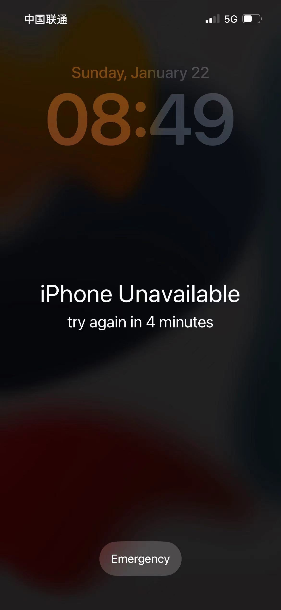

It's the new year's day today. On my way to the new year's visit, however, the message "iPhone Unavailable..."  appears on the phone screen. 

What's wrong with it? Whether it will be permanently locked and turn into a "brick"（砖头）. 

{width=100%}

Subsequently, what I could try is to restart it, but it still didn't work. So I have to wait to see what will happen next, after the timer ran out.

  ......

Thank heaven. It could be accessed by typing the correct password.

But, what caused this interface? I searched "iPhone Unavailable" on Bing, and found that the phone was mistakenly touched many times in my pocket.  Simultaneously I recalled the vibration my hand felt this morning from phone when entering the incorrect password.

突然悟了

**What a fool I am.**

> The “iPhone Unavailable” black screen appears after too many wrong passcode attempts. 

[Reference](https://www.howtogeek.com/849546/how-to-fix-the-iphone-unavailable-screen/)

