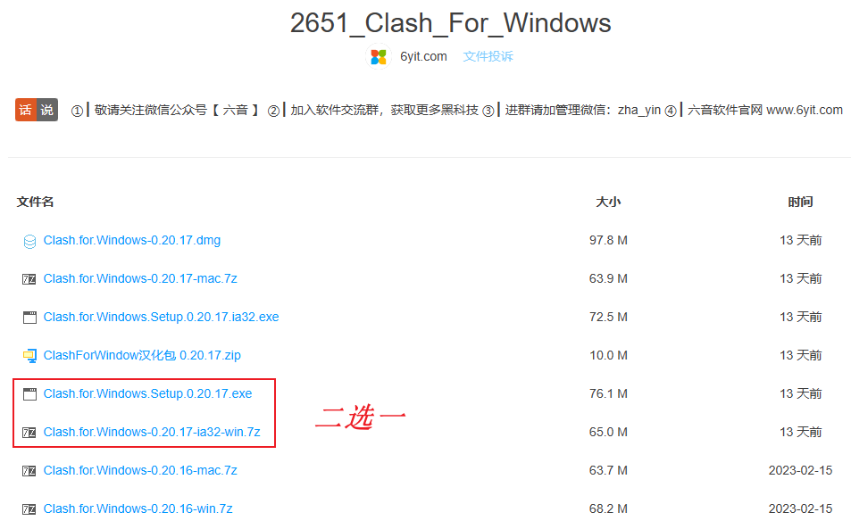
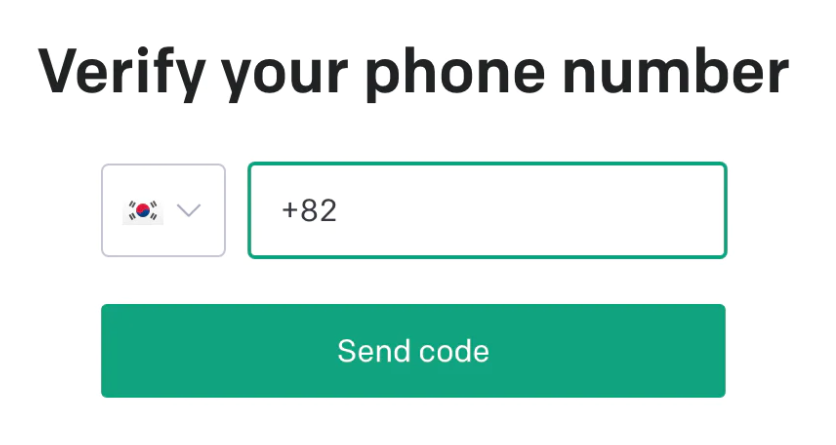
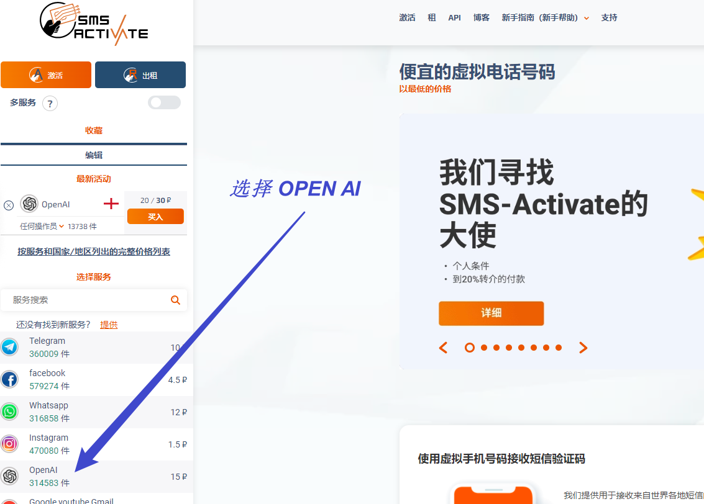

OpenAI已买下ai.com域名，输入[ai.com](ai.com)链接跳转至Chat GPT登录界面。


# 注册VPN

1. 下载[八方云VPN](https://xn--9kq52et30a.com/)：使用文档 -> Clash for windows使用教程 -> 蓝奏网盘下载 (Figure \@ref(fig:clashvpn))；
1. 购买订阅（即，购买使用VPN时所需的流量）-> `按流量`购买；
1. 导入订阅：仪表盘 -> 一键订阅 -> 导入到Clash for windows。  
将购买的流量导入到Clash中


(ref:clashvpn) Clash For Windows，下载时选择对应系统下的版本

```{r clashvpn, echo=FALSE, out.width="80%", fig.cap='(ref:clashvpn)'}

```


# Clash for windows软件使用

## General菜单

VPN开关

- 点击`System proxy`，连接VPN；
- 不使用时，关闭`System proxy`即可。

## Proxies菜单

- 选择<代理模式>：
  - **（默认）**Rule模式
  - 也可选择Global全局模式
- <线路>的选择：
  - **（默认）**自动选择
  - 如果需要手动选择，一般选择香港、日本、新加坡、台湾线路
  - 优先选择延迟较低的线路


# 注册ChatGPT

## 前提

**连接VPN。**

如果网页内容故障，可更换代理模式尝试（Rule或者Global）；更换节点线路。


## 打开[Chat注册界面](https://beta.openai.com/signup)：

- 输入邮箱后，Chat会发送邮件到邮箱；
  - 教育邮箱、Gmail邮箱可以使用；
  - QQ邮箱，网易163邮箱无法注册；
- 点击邮件中的链接进行验证；
- 输入First name及Last name；
- （关键步骤）输入国外的手机号进行验证；


{width=50%}


## 临时国外手机号

这里我们需要在[该网页中](https://sms-activate.org/)购买一个临时国外手机号，接收短信验证码，以通过验证。


- 依然先注册，然后登录；
- 右上角余额处，点击充值，支付宝支付；
- 选择OpenAI (Figure \@ref(fig:sms-act))；
- 可购买**英格兰**手机号码（有些国家的号码经常收不到短信）；

(ref:sms-act) 购买OpenAI服务中的手机号

```{r sms-act, echo=FALSE, out.width="80%", fig.cap='(ref:sms-act)'}

```


**最后一步：**复制购买的手机号，返回Chat GPT注册界面，选择国家United Kingdom并输入手机号。点击`Send code`。

验证完短信验证码后，如果不出意外，就可以使用了。

> 这里需要注意，购买临时手机号后，刷新界面，正常2分钟内可收到验证码。如果没收到，说明该号码是有问题的，需重新购买，没收到验证码的之后会给退款。


# FAQ常见问题

1. OpenAI's services are not available in your country
2. Access denied

第一个问题比较好解决，确保已连接VPN。刷新界面。如果仍显示not available，可以清理一下浏览器的cookie记录。重新刷新界面。


第二个问题。不好解决，可以在网上搜索解决方法。遇到Access denied，建议就是更换浏览器尝试；或者更换代理模式Global/Rule；更换线路（日本或新加坡、等）；

注册时如果遇到问题，尤其是注册完第一次登录时很有可能遇到问题。很多时候需要清理Cookie，更换浏览器。**（有时候换个浏览器就可以了）**。如果刷新界面仍不行，只能是过一段时间再尝试。


晚上Chat GPT服务器负载量可能比较大，很有可能进不去Chat界面。


