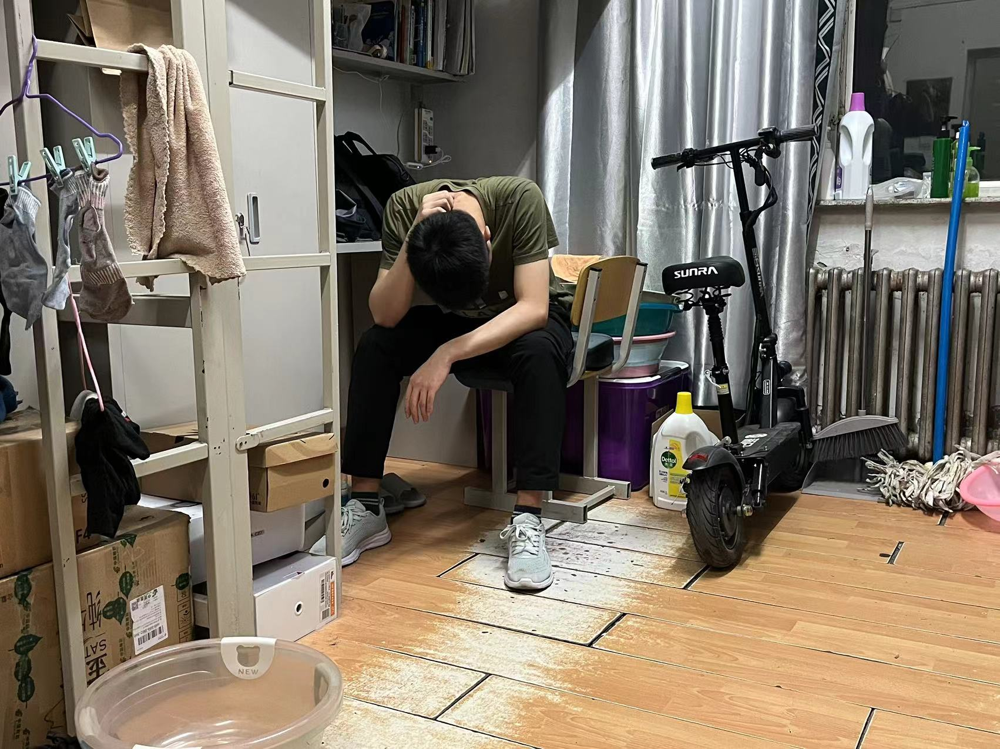
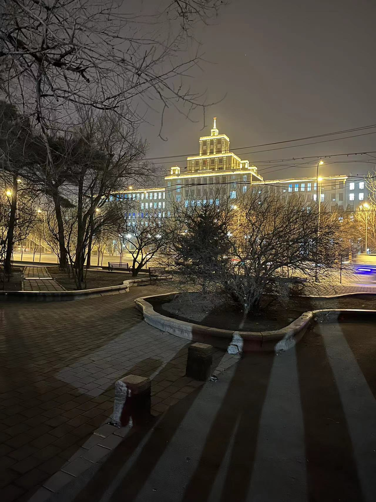

我们三个有着共同的目标，就是把这件事做好。


短短一周遭遇了无数的问题，一个接一个，有过太多次的触动。


我记得那天中午在主楼的小屋，三个人因为流程出错面临“返工”时的愁眉苦脸。崩溃、问寻、协商、思考、敲定，然后接着往下干。


我记得小孔斩钉截铁地说，我的饭可以被污染，但我的样品不能被污染；我记得她反复叮嘱我去清洗那只烧杯，“哎呀，不要吃大胆药、不要吃大胆药”，（虽然我还是忘洗了）。


今天是称样的最后一天，我知道，这几天完全不在舒适区里，每个人都希望这波快点结束。可偏偏今晚又让我们痛苦了一次。我们把借用的离心机搞出了问题。我板着严肃的脸，不知道说些什么，心中只有无限的歉意。这是很严肃的问题！


这起事故仿佛在我拆开平底离心管的那刻开始就注定要发生一样，虽然我有过担忧。可它还是猝不及防地发生了。小孔也在不停自责。这真的很难避免，我觉得只有过细之人才能注意到。今天换成另外一个人，也还是会……

长江火速从宿舍赶来。他说，这次的经历和教训其实才是最宝贵的东西。我赞成。后面长江讲他之前“水漫实验室”的情况下冲进去关水龙头。事后才知道，水位离电闸不到1厘米。
原来师兄也经历过生死瞬间。


这波只是开始。我说的“开始”指很多方面。


现在我觉得，并不仅仅是“要把这件事做好”在支撑我。更重要的是，在我身陷困境的时候，他两让我知道，我并不是一个人……\@ref(fig:shadows)


{width=100%}

(ref:shadows) 仓库杂乱不堪，缺乏管理迟早会印证“破窗效应”。收拾了一番，分完样从仓库出来


```{r shadows, echo=FALSE, out.width="80%", fig.cap='(ref:shadows)'}

```


Last but not least，（那个实验室的人），感谢感谢！


