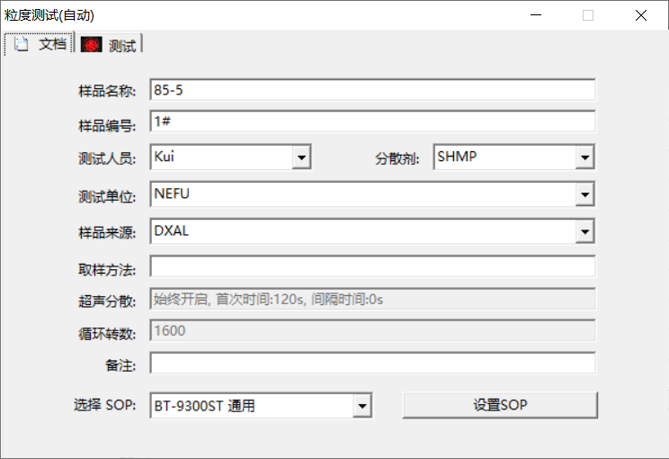
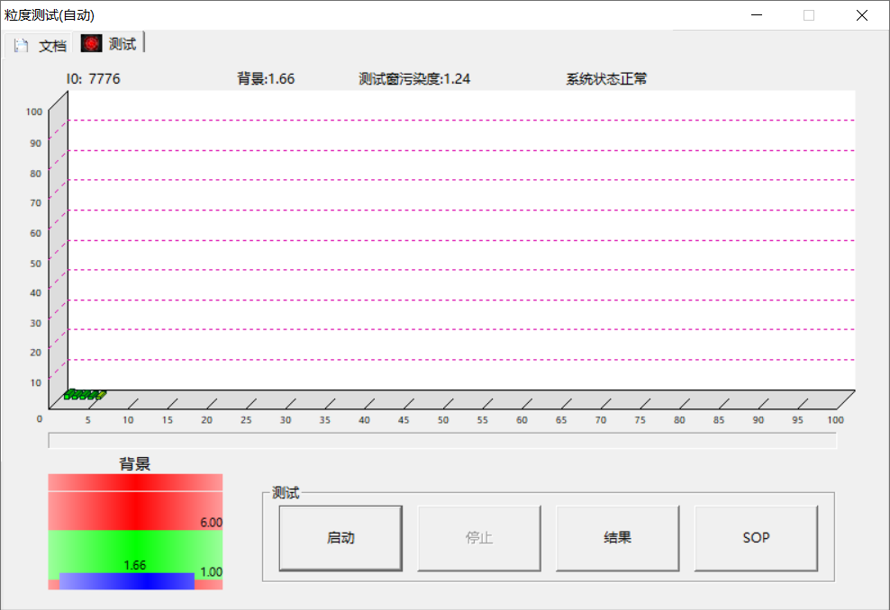

# 前期准备

## 仪器及耗材

1.5mm试验筛、50mL尖底离心管、30%H~2~O~2~、10%HCl、六偏磷酸钠、激光粒度分析仪、移液枪、磁力搅拌器、摇床、离心机、pH试纸、

## 样品制备

称7~10g的湿土，风干后过筛（最大量程1500μm，要事先过1.5mm筛）。

**需要格外注意**，尤其是水分含量高的土壤，**在样品半干时，必须及时将土块敲碎打散**（使其达到可过筛的程度），但不能过分用力，避免过度破坏其结构。若不进行打散，完全风干后土壤结成非常硬的硬块，无法过筛！


## 前处理

### 为什么要进行前处理

有机质和盐类，如CaSO~4~，会产生絮凝与胶结，影响样品的测定。

可加入过氧化氢去除有机质；加入分散剂消除絮凝干扰；难溶性碳酸盐会干扰土粒分散，用过量盐酸去除干扰。

### 前处理步骤

- 称取0.5g风干过筛的土壤，到50mL离心管，加入10mL的**30% H~2~O~2~** [@ma_divergent_2018]，摇匀后静置过夜，直到没有气泡产生；
- 加入10mL的**10% HCl** [@ma_divergent_2018]，摇匀后在摇床振荡1~2h（主要去除碳酸盐，反应较快，可能不用静置过夜）；随后进行离心1700r，5min，倒掉上清液；
- 除酸。往50mL离心管中加入去离子水，放入离心机进行离心，1700r，3min；弃去上清液，继续加去离子水，离心；直到pH接近中性。倒掉上清液；
- 加入10mL的0.05M或10% **[(NaPO~3~)~6~]**分散剂溶液，超声波分散仪10min或摇床振荡8h。
- 进行离心或自然沉降一段时间，倒掉部分上层的六偏磷酸钠溶液，保留5mL左右。盖上离心管盖，上机前将土壤溶液**摇匀**，迅速倒入激光粒度仪循环池。(**倒入适量**，否则遮光率会过高)

### 注意事项

- 在离心的过程中，样液最上层经常会悬浮凋落物残渣，倒上清液时需要将其也倒掉。
- 配置六偏磷酸钠溶液时，试剂变成像凡士林一样的胶状，须用磁力搅拌器进行溶解。


# 仪器使用


下载仪器配套软件及其驱动，将仪器和电脑连接。随即检查仪器的硬件功能，打开软件，依次点击进水，循环，超声，自动清洗按钮。

**新建工程**

工程页->右击新建工程->回到记录页


**检查仪器状态**


点击**粒度测试(自动)**，填写基本信息，SOP选择**BT-9300ST 通用** (Figure \@ref(fig:auto-doc))；

(ref:auto-doc) 基本信息。其中，分散剂SHMP代表六偏磷酸钠，土壤前处理步骤中使用了该分散剂。

(ref:auto-test) 自动粒度测试，测试界面

```{r auto-doc, echo=FALSE, out.width="80%", fig.cap="(ref:auto-doc)"}

```

接着，我们**每次测定前都须关注**测试界面的参数值 (Figure \@ref(fig:auto-test))：

- 背景值范围，约在1.4~2.2；
- 测试窗污染度，约在0.9~1.5；
- 系统状态：正常；
- 二维坐标X轴上的绿色信号小于10，图形大小逐渐变小；

```{r auto-test, echo=FALSE, out.width="80%", fig.cap="(ref:auto-test)"}

```


若系统状态非正常或污染度过高，在软件内点击`循环`和`自动清洗`，通过此步骤来尝试解决问题。


**确认仪器状态正常后**


点击启动。将自动进水、消泡、测背景值。

当提示加入样品时，再向池中加入（摇匀的）土壤溶液，将自动调整遮光率、自动超声分散、自动测试与保存结果、自动清洗。

这里需要注意的是，加入的样液只需几毫升，**适量加入，使遮光率蓝条落在绿色区间**即可！


使用完后，排干净循环池中的水，点击一次开始排水，再点一次停止排水。将白色手帕塞入循环池，放置壁周受到污染。


# 其他

## 仪器维护


使用一段时间后，玻璃样品池会受到污染，需定期清理。点排水按钮将循环池中的水排干净，很重要。拆出样品池，把套有白布的刷子沾湿，并滴一滴洗涤剂，刷干净玻璃池，并擦干样品池外表面水分。安装回去，点进水和循环按钮，检查样品池是否漏水。最后将玻璃样品池推回仪器里面。


## 稀释浓盐酸

市面上浓盐酸质量分数$w_1$为36%-38%，浓度约为12mol/L，密度$\rho_1 = 1.19 g/mL$，我们要对其稀释到$w_2 = 10\%$，密度约为$\rho_2 = 1.05 g/mL$。

如果要配置稀盐酸$V_2 = 1000mL$，需要多少体积的浓盐酸？

稀释前后溶质质量不变 \@ref(eq:solute-volumn)：

$$
\rho_1V_1\omega_1 = \rho_2V_2\omega_2
(\#eq:solute-volumn)
$$

计算可得，配置1L稀盐酸所需浓盐酸的体积$V_1$ = `r 1.05*1000*0.1/1.19/0.37`mL。


## 相关链接

- [丹东百特BT-9300ST (本实验所使用仪器)](https://www.bettersize.com/prodetail?id=122)
- [丹东百特BT-9300ST操作视频](https://mp.weixin.qq.com/s/z4lDsfFFLl-6mw0ybPnz8w)
- [Mastersizer 3000](https://www.malvernpanalytical.com.cn/products/product-range/mastersizer-range/mastersizer-3000)
- [Pario土壤粒径分析仪](https://mp.weixin.qq.com/s/QyIlukHpsyjK0DRKIdQg3Q)

## 我的疑问

测定显示的结果是各粒级颗粒所占的体积百分比，而非质量百分比，后续如何进行数据转化？

# Reference


