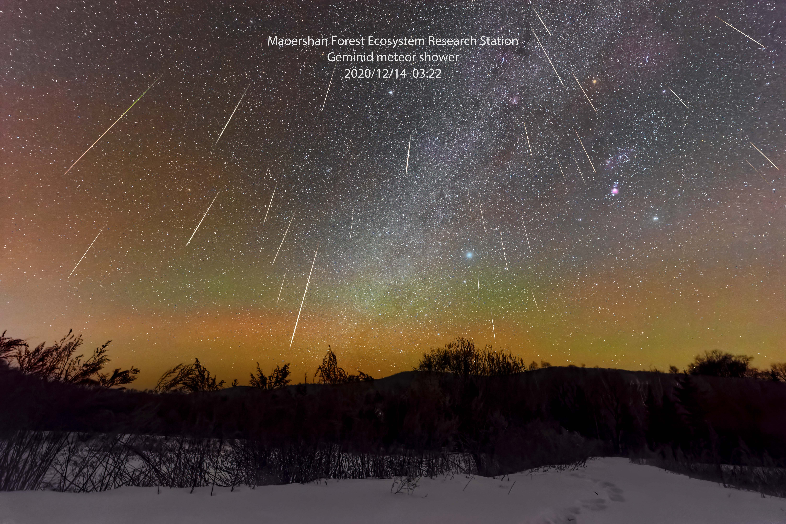
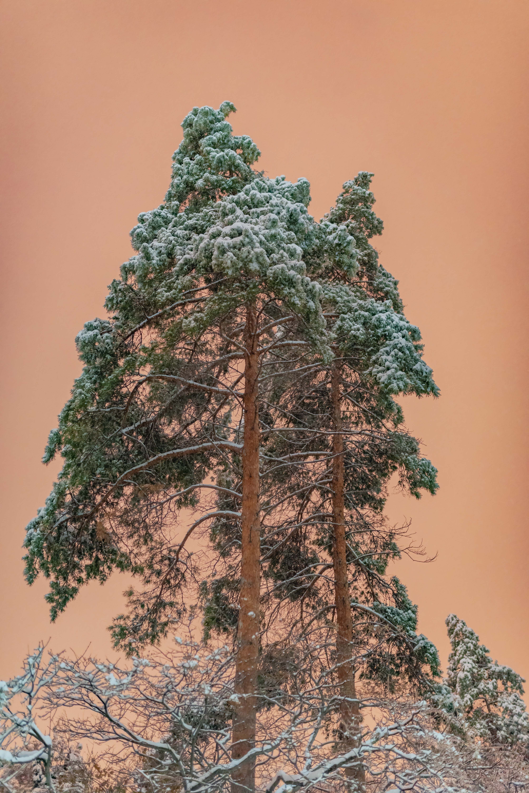

**I love three things in this world.**

**The sun, the moon and you.**

**The sun for the day, the moon for the night , and you forever.**

浮世三千，吾爱有三。日月与卿。日为朝，月为暮，卿为朝朝暮暮。

{width=100%}
{width=100%}
{width=100%}
{width=100%}
{width=100%}
{width=100%}
{width=100%}
{width=100%}
{width=100%}
{width=100%}
{width=100%}
{width=100%}
{width=100%}
{width=100%}
{width=100%}
{width=100%}
{width=100%}
{width=100%}
{width=100%}

